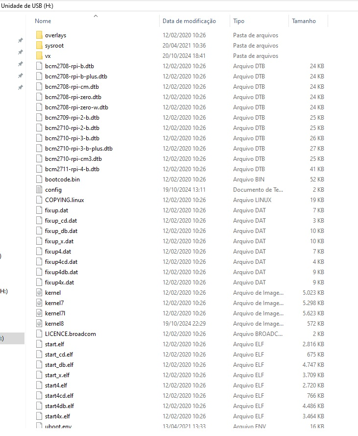

# Configurando setup para VxWorks Raspberry PI 3

## Introdução
O SDK do VxWorks 7 é um ambiente de desenvolvimento dedicado aos desenvolvedores de aplicativos VxWorks, que inclui os seguintes recursos:

- Ferramentas padrão de compilação cruzada baseadas em clang/LLVM, que podem ser usadas para compilar tanto módulos de kernel descarregáveis (DKM) quanto aplicativos RTP (Real Time Process).
- Gerenciamento de compilação simplificado: makefile, cmake, personalização própria.
- Específico para o alvo/arquitetura: inclui um kernel genérico do VxWorks, que pode ser inicializado na plataforma de destino.
- Arquivos de cabeçalho e bibliotecas para desenvolvimento de aplicativos.
- Depurador Wind River (wrdbg).
- Documentação.

Este guia ajuda você a começar a desenvolver aplicativos para plataformas que executam VxWorks. Você pode usá-lo para criar novos aplicativos ou explorar as capacidades do VxWorks.

# Importante
É altamente recomendado tilizar um sistema linux/ubuntu/debian sem usar máquina virtual para todas as etapas a seguir, em certos momentos ao extrair os arquivos compactados ou tentar conectar o raspberry com o servidor FTP, erros ocorrerão por causa do ambiente virtual e Windows afetando os arquivos.

# Setup

## Configurar ambiente de desenvolvimento
O primeiro passo para instalação do  VxWorks é a partir do download do VxWorks SDK que pode ser encontrado neste link: https://labs.windriver.com/

O SDK para o Raspberry Pi 3 está nesse link antigo: https://labs.windriver.com/downloads/wrsdk_labs.html


## Configurando o ambiente de desenvolvimento

Primeiramente deve ser rodado o seguinte comando:
`````
sudo apt install build-essential libc6:i386
`````
Em caso de erro, tentar a seguinte sequência:
`````
sudo dpkg --add-architecture i386
sudo apt update
sudo apt install libc6:i386
sudo apt install bison flex
sudo apt install libssl-dev
sudo apt install libgnutls28-dev
`````
Em seguida, ter um servidor FTP instalado no seu host onde é realizado o desenvolvimento facilitará a implementação de aplicativos e permitirá o acesso ao sistema de arquivos do host a partir de um alvo VxWorks.

Para acomodar as diversas configurações de tempo de execução das imagens do kernel VxWorks incluídas nos SDKs, você pode estar interessado em usar uma opção de servidor FTP baseada no pyftpdlib.
`````
sudo apt install python3-pip
sudo pip install pyftpdlib
`````
Em caso de erro, tentar a seguinte sequência:
`````
sudo apt install python3-pyftpdlib
`````

## Para criar o cartão SD com o firmware:

Formate o cartão SD como FAT32 file system, e baixe o arquivo a seguir:

https://github.com/raspberrypi/firmware/archive/1.20200212.tar.gz

E.g. wget https://github.com/raspberrypi/firmware/archive/1.20200212.tar.gz

Extraia a pasta (se você estiver utilizando Windows, descompacte em um ambiente Linux ou você terá problemas.), e então copie os arquivos da pasta `boot` dentro do cartão SD.

## Copiar os arquivos do diretorio /vxsdk/sdcard/ para o cartão SD.

Extraia o arquivo SDK baixado na primeira etapa [(Configurar ambiente de desenvolvimento)](#configurar-ambiente-de-desenvolvimento), e copie os arquivos da pasta `/vxsdk/sdcard/` para o cartão SD.

## Compilar o arquivo u-boot binario para o Raspberry PI 3
Nessa etapa estaremos documentando dois passos, você só precisará fazer um deles.

1- Metodo mais simples:

Baixe o arquivo [kernel8.img](/etapa_1/setup_files/kernel8.img) desse repositório e salve ele no cartão SD. Exemplo: (Cartão SD/kerlnel8.img)

2- Compile e salve o seu propio arquivo u-boot seguindo os passos a seguir:

```
$ sudo apt install gcc-aarch64-linux-gnu
$ git clone https://gitlab.denx.de/u-boot/u-boot.git  
$ cd u-boot  
$ CROSS_COMPILE=aarch64-linux-gnu- make rpi_3_b_plus_defconfig  
$ CROSS_COMPILE=aarch64-linux-gnu- make  
```
Após compilar o arquivo u-boot.bin, copie e cole ele no cartão SD como `kernel8.img`
## Crie uma pasta chamada vx no cartão SD
Crie uma pasta chamada vx no seu Cartão SD e nela coloque o arquivo uVxWorks que pode ser encontrado dentro da pasta descompactada do SDK instalado na etapa: [(Configurar ambiente de desenvolvimento)](#configurar-ambiente-de-desenvolvimento)
O arquivo `uVxWorks`pode ser encontrado no caminho `/vxsdk/bsps/rpi_3_0_1_1_2/uVxWorks`

## Cartão SD Final ficará assim:


# Conectando Raspberry e boot com VxWorks
Com o cartão SD pronto, já é possível inserir o cartão de volta no Raspberry Pi 3, agora para a conexão com o Raspberry utilizaremos um adaptador USB para UART.
Nesse projeto utilizamos um Raspberry PI 3B+ então suas portas para comunicação UART podem ser encontradas nesse diagrama:


Conecte o pino 6 com o Ground do adaptador

Conecte o pino 8 com o pino RX do adaptador (TX<->RX)

Conecte o pino 10 com o pino TX do adaptador (RX<->TX)

Tenha certeza que os cabos no adaptador US-UART estão certos, caso não apareça nada no terminal após "bootar" o Raspberry, verifique as conexões e tente novamente.

Escolha algum programa de comunicação serial (por exemplo o minicom):
```
sudo apt-get install minicom
sudo minicom -s
```
Configure a conexão serial para ter os parametros a seguir e salve como dfl:
```
Baud Rate: 115200
Data: 8 bit
Stop: 1 bit
Parity: None
Flow Control: None
```
Para começar o monitoramento na porta utilize o comando a seguir, considerando que ttsyUSB0 é a porta onde o adaptador está conectado.
```
ls /dev/tty* // Comando para ver quais portas existem no seu sistema.
# minicom ttyUSB0
ou apenas
# minicom
```
Após começar o monitoramento na porta escolhida, ligue o Raspberry com o cartão SD já dentro e o VxWorks kernel vai "bootar" automaticamente:
```
U-Boot 2024.10-01129-g7036abbd5c39 (Oct 19 2024 - 22:28:55 -0300)

DRAM:  948 MiB
RPI 3 Model B+ (0xa020d3)
Core:  79 devices, 13 uclasses, devicetree: board
MMC:   mmc@7e202000: 0, mmcnr@7e300000: 1
Loading Environment from FAT... OK
In:    serial,usbkbd
Out:   serial,vidconsole
Err:   serial,vidconsole
Net:   No ethernet found.

starting USB...
Bus usb@7e980000: USB DWC2
scanning bus usb@7e980000 for devices...
Warning: lan78xx_eth MAC addresses don't match:
Address in DT is                b8:27:eb:15:90:74
Address in environment is       b8:27:eb:06:66:ec
4 USB Device(s) found
       scanning usb for storage devices... 0 Storage Device(s) found
Hit any key to stop autoboot:  0
9157968 bytes read in 387 ms (22.6 MiB/s)
## Booting kernel from Legacy Image at 08000000 ...
   Image Name:   vxworks
   Image Type:   AArch64 VxWorks Kernel Image (uncompressed)
   Data Size:    9157904 Bytes = 8.7 MiB
   Load Address: 00100000
   Entry Point:  00100000
   Verifying Checksum ... OK
Working FDT set to 0
   Loading Kernel Image to 100000
   !!! WARNING !!! Using legacy DTB
## Starting vxWorks at 0x00100000, device tree at 0x00000000 ...
Instantiatm0 as rawFs,  devx1
Formatting /ram0 for HRFS v1.2
Instantiating /ram0 as rawFs, device = 0x1
Formatting...OK.
Targe vxTargetantiating /tmp as  device = 0x10001
Formatting /tmp for HRFS v1.2
Instantiating /tmp as rawFs, device = 0x10001
Formatting...OK.

 _________            _________
 \........\          /......../
  \........\        /......../
   \........\      /......../
    \........\    /......../
     \........\   \......./
      \........\   \...../              VxWorks SMP 64-bit
       \........\   \.../
        \........\   \./     Release version: 21.03
         \........\   -      Build date: Apr 20 2021 16:34:43
          \........\
           \......./         Copyright Wind River Systems, Inc.
            \...../   -                 1984-2021
             \.../   /.\
              \./   /...\
               - --

                   Board: Raspberry Pi 3 Model B+ - ARMv8
               CPU Count: 4
          OS Memory Size: ~883MB
        ED&R Policy Mode: Deployed
     Debug Agent: Started (always)
         Stop Mode Agent: Not started
              BSP Status: *** UNSUPPORTED ***

usrNetDevNameGet: no network device
usrNetDevNameGet: no network device
Thu Jan  1 00:00:01 1970: ipcom_drv_eth[1e6170]: Error: ipcom_drv_eth_bind_to_devs :: failed to get name of boot device

 Adding 14452 symbols for standalone.

-> Thu Jan  1 00:00:05 1970: ipnet[196b70]: Error: ipcom_getsockaddrbyaddr failed gw: dhcp
Attached TCP/IP interface to usb2End unit 0
Connecting to the Network...

Network configuration:
ifname usb2End0 inet 192.168.0.241 mac 00:11:22:33:44:55

This device is also accessible over telnet!
        E.g. telnet 192.168.0.241
```

# Para acessar via telnet.
Para acesso ao VxWorks sem a utilização do adaptador USB-UART, é preciso ter instalado o telnet.
```
sudo apt install telnet
```
E acessar o IP do seu Raspberry utilizando o comando:
```
telnet 192.168.0.241
```

# Desenvolvendo uma aplicação:

## Crie um arquivo em C como por exemplo foo.c:
```
#include <stdio.h>

int main(void)
    {
    printf("hello, world!\n");
    return 0;
    }
```
## Crosscompile o arquivo foo.c usando o comando:

Dentro da pasta instalada no passo [(Configurar ambiente de desenvolvimento)](#configurar-ambiente-de-desenvolvimento), crie um arquivo `source`do SDK e utilize o comando para fazer a compilação.

```
$ source sdkenv.sh
$ wr-cc -rtp foo.c -static -o foo.vxe
```
Você terá um arquivo foo.c e foo.vxe no diretorio onde você compilou.

## Crie um servidor FTP:

Crie um servidor FTP na porta 21, utilizando como usúario e senha as seguintes credenciais.

- user: target
- password: vxtarget

Abra um terminal na pasta `home`e rode o comando:
```
$ sudo python3 -m pyftpdlib -p 21 -u target -P vxTarget -d home &
```

Anote o IP do host onde o servidor FTP foi aberto, em linux o comando `ip a` serve.
Também é possível testar se o servidor está funcionando corretamente, abrindo um outro terminal e utilizando o comando:
```
sudo ftp localhost
```
#Lembrete# o destiono `#HOME` pode ser diferente caso os arquivos foo estejam armazenados em um Path diferente.

## Conecte o vxWorks no servidor FTP e execute o arquivo compilado:
Após ter o servidor FTP rodando, execute o comando no vxWorks shell:
```
-> netDevCreate ("/wrs", "192.168.10.191", 1)
```
Onde (192.168.10.191) é o IP do host onde o servidor FTP foi criado.

Finalmente siga os comandos a seguir:
```
-> cmd
[vxWorks *]# cd /wrs
[vxWorks *]# pwd
/wrs/
[vxWorks *]# ls foo.c
foo.c
[vxWorks *]# more foo.c
#include <stdio.h>

int main(int argc, char **argv) {
    printf("Hello World\n");
    return 0;
}
[vxWorks *]#
[vxWorks *]# foo.vxe
Launching process 'foo.vxe' ...
Process 'foo.vxe' (process Id = 0xffff8000005e85d0) launched.
Hello world
[vxWorks *]#
```

# Referência Principal
https://labs.windriver.com/downloads/wrsdk-vxworks7-docs/2103/README_raspberrypi3b.html
