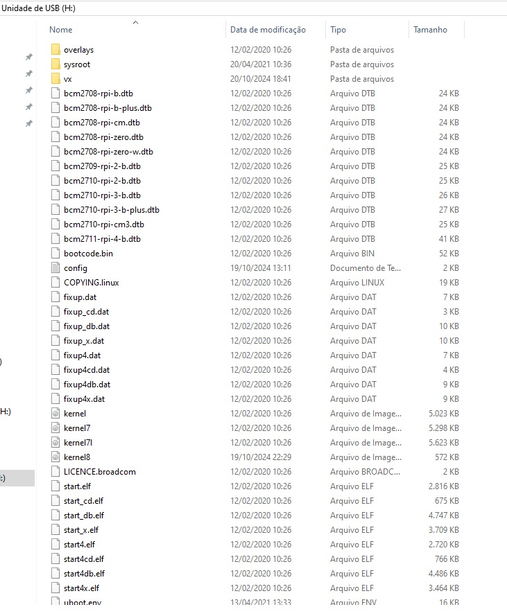
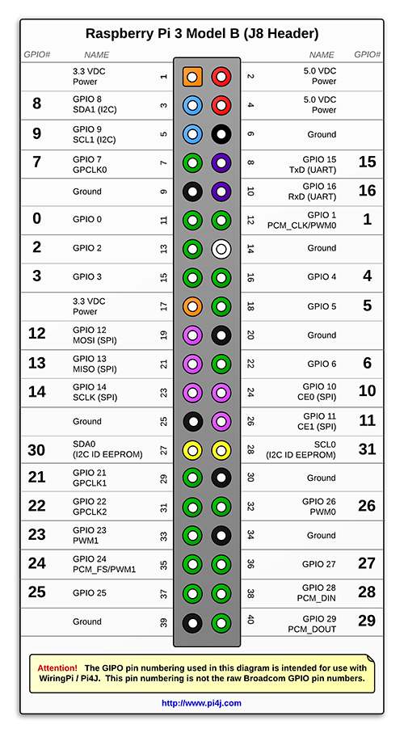

# Configurando setup para VxWorks Raspberry PI 3

## Introdução
O SDK do VxWorks 7 é um ambiente de desenvolvimento dedicado aos desenvolvedores de aplicativos VxWorks, que inclui os seguintes recursos:

- Ferramentas padrão de compilação cruzada baseadas em clang/LLVM, que podem ser usadas para compilar tanto módulos de kernel descarregáveis (DKM) quanto aplicativos RTP (Real Time Process).
- Gerenciamento de compilação simplificado: makefile, cmake, personalização própria.
- Específico para o alvo/arquitetura: inclui um kernel genérico do VxWorks, que pode ser inicializado na plataforma de destino.
- Arquivos de cabeçalho e bibliotecas para desenvolvimento de aplicativos.
- Depurador Wind River (wrdbg).
- Documentação.

Este guia ajuda você a começar a desenvolver aplicativos para plataformas que executam VxWorks. Você pode usá-lo para criar novos aplicativos ou explorar as capacidades do VxWorks.

# Importante
É altamente recomendado tilizar um sistema linux/ubuntu/debian sem usar máquina virtual para todas as etapas a seguir, em certos momentos ao extrair os arquivos compactados ou tentar conectar o raspberry com o servidor FTP, erros ocorrerão por causa do ambiente virtual e Windows afetando os arquivos.

# Setup

## Configurar ambiente de desenvolvimento
O primeiro passo para instalação do  VxWorks é a partir do download do VxWorks SDK que pode ser encontrado neste link: https://labs.windriver.com/

O SDK para o Raspberry Pi 3 está nesse link antigo: https://labs.windriver.com/downloads/wrsdk_labs.html


## Configurando o ambiente de desenvolvimento

Primeiramente deve ser rodado o seguinte comando:
`````
sudo apt install build-essential libc6:i386
`````
Em caso de erro, tentar a seguinte sequência:
`````
sudo dpkg --add-architecture i386
sudo apt update
sudo apt install libc6:i386
sudo apt install bison flex
sudo apt install libssl-dev
sudo apt install libgnutls28-dev
`````
Em seguida ter um servidor FTP instalado no seu host de desenvolvimento facilitará a implantação de aplicativos e permitirá o acesso ao sistema de arquivos do host a partir de um alvo VxWorks.

Para acomodar as diversas configurações de tempo de execução das imagens do kernel VxWorks incluídas nos SDKs, você pode estar interessado em usar uma opção de servidor FTP baseada no pyftpdlib.
`````
sudo apt install python3-pip
sudo pip install pyftpdlib
`````
Em caso de erro, tentar a seguinte sequência:
`````
sudo apt install python3-pyftpdlib
`````

## Para criar o cartão SD com o firmware:

Formate o cartão SD como FAT32 file system, e baixe o arquivo a seguir:

https://github.com/raspberrypi/firmware/archive/1.20200212.tar.gz

E.g. wget https://github.com/raspberrypi/firmware/archive/1.20200212.tar.gz

Extraia a pasta (se você estiver utilizando Windows, descompacte em um ambiente Linux ou você terá problemas.), e então copie os arquivos da pasta `boot` dentro do cartão SD.

## Copiar os arquivos do diretorio /vxsdk/sdcard/ para o cartão SD.

Extraia o arquivo SDK baixado na primeira etapa [(Configurar ambiente de desenvolvimento)](#configurar-ambiente-de-desenvolvimento), e copie os arquivos da pasta `/vxsdk/sdcard/` para o cartão SD.

## Compilar o arquivo u-boot binario para o Raspberry PI 3
Nessa etapa estaremos documentando dois passos, você só precisará fazer um deles.

1- Metodo mais simples:

Baixe o arquivo [kernel8.img](/etapa_1/setup_files/kernel8.img) desse repositorio e salve ele no cartão SD. Exemplo: (Cartão SD/kerlnel8.img)

2- Compile e salve o seu propio arquivo u-boot seguindo os passos a seguir:

```
$ sudo apt install gcc-aarch64-linux-gnu
$ git clone https://gitlab.denx.de/u-boot/u-boot.git  
$ cd u-boot  
$ CROSS_COMPILE=aarch64-linux-gnu- make rpi_3_b_plus_defconfig  
$ CROSS_COMPILE=aarch64-linux-gnu- make  
```
Após compilar o arquivo u-boot.bin, copie e cole ele dentro do cartão SD como `kernel8.img`
## Crie uma pasta chamada vx no cartão SD
Crie uma pasta chamada vx no seu Cartão SD e nela coloque o arquivo uVxWorks que pode ser encontrado dentro da pasta descompactada do SDK instalado na etapa: [(Configurar ambiente de desenvolvimento)](#configurar-ambiente-de-desenvolvimento)
O arquivo `uVxWorks`pode ser encontrado no caminho `/vxsdk/bsps/rpi_3_0_1_1_2/uVxWorks`

## Cartão SD Final ficará assim:


# Conectando Raspberry e boot com VxWorks
Com o cartão SD pronto, já é possível inserir o cartão de volta no Raspberry Pi 3, agora para a conexão com o Raspberry utilizaremos um adaptador USB para UART.
Nesse projeto utilizamos um Raspberry PI 3B+ então suas portas para comunicação UART podem ser encontradas nesse diagrama:


Conecte o pino 6 com o Ground do adaptador

Conecte o pino 8 com o pino RX do adaptador (TX<->RX)

Conecte o pino 10 com o pino TX do adaptador (RX<->TX)

## 
Seguindo todas as etapas passadas, o seu cartão SD ficará

Tenha certeza que os cabos no adaptador US-UART estão certos, caso não apareça nada no terminal após "bootar" o Raspberry, tente inverter os cabos no adaptador RX<->TX e verifique novamente.

Escolha algum programa de comunicação serial (por exemplo o minicom), e configure a conexão serial para ter os parametros a seguir:
```
Baud Rate: 115200
Data: 8 bit
Stop: 1 bit
Parity: None
Flow Control: None
```

Após começar o monitoramento na porta escolhida, ligue o Raspberry com o cartão SD já dentro e o VxWorks kernel vai "bootar" automaticamente:

# Referencia Principal
https://labs.windriver.com/downloads/wrsdk-vxworks7-docs/2103/README_raspberrypi3b.html
